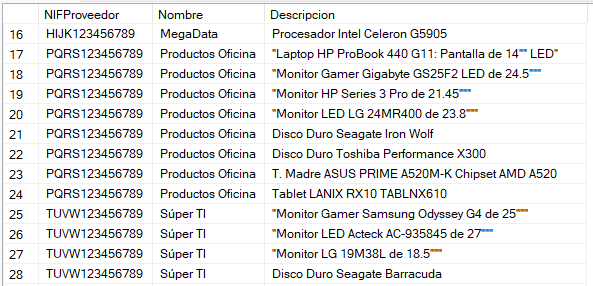
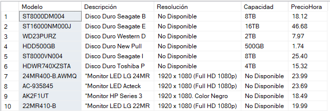

<h2>📚 Descripción general:</h2>
 
En esta actividad realicé la definición de una base de datos relacional a partir de un enunciado de ejemplo extraído de Slideshare. El archivo .sql contiene la estructura de la BD, creación de tablas, relaciones entre tablas y algunas consultas relevantes para una tienda de cómputo ficticia INFORDATA.   
▫️Los datos de proveedores, clientes, números de teléfono, IDs, NIFs, domicilios y fechas han sido material creado como ejemplo y para fines educativos durante esta actividad.  
▫️Algunos datos, como códigos, descripciones de producto y precios fueron extraídos de  <a href= "https://www.pcel.com/index.php?route=common/home">PCEL, Súper tienda de cómputo</a>

  
<h2>⚙️Tecnologías: </h2>
 
    • SQL Server  
    • Wondershare EdrawMax  
 

<h2>🖇️ Fuente: </h2> 
https://es.slideshare.net/slideshow/enunciados-de-casos-para-bases-de-datos/12547875 (Pag. 8).

 
<h2>🧩 Tablas creadas:</h2
 
Productos (Código, NIF de Proveedor, Modelo, Descripción, Memoria principal, Velocidad, Capacidad, Resolución máxima, Precio). 
Proveedores (NIF de Proveedor, Nombre, Dirección). 
Movimientos (ID, Código de producto, DNI de Cliente, Concepto, Fecha, ID de Soporte). 
Clientes (DNI de Cliente, Nombre, Apellido Paterno, Apellido Materno, Teléfono, Domicilio). 
Alquiler (Código de Producto, Precio por Hora). 
Soporte técnico (ID de Soporte, ID de Empresa, Código de Producto, Descripción, Precio). 
Fabricante (ID de Empresa, Nombre, País de Origen). 
Alta Tecnología (Código de Producto, ID de Empresa, Fecha de Fabricación). 
 
 
<h2>📊 Actividades: </h2>
 
  • Definición de llaves primarias con atributos Identity.  
  • Definición de llaves foráneas para facilitar consultas con filtros en la base de datos.  
  • En campos como DNICliente se define el tipo de dato como nvarchar (12) para delimitar el número de caracteres que puede ser registrado.  
  • Se permiten registros nulos en varios campos de la tabla Movimientos, ya que, conforme al enunciado, cada producto tiene datos de interés distintos.  
  • En la tabla Movimientos se registran todas las operaciones, en el campo Concepto se aplica Constraint y Check para delimitar las opciones a Ventas, Alquiler y Soporte.  
  • Realización de un procedimiento almacenado que niega el Soporte Técnico si un producto no ha sido vendido al mismo cliente anteriormente. 
  
 
<h2>Diagrama Entidad - Relación</h2>
 

  
<h2>Consultas realizadas: </h2>
 
▫️Productos por Proveedor  

  
▫️Precio de alquiler por hora (sólo para monitores y discos duros)  

  
▫️Productos de 'Alta Tecnología'  

  
▫️Detalle de clientes que han adquirido impresoras   
  
▫️Restricción de Servicio técnico a productos que no han sido adquiridos por el cliente  

  
<h2>🔶 Conclusión:</h2>
 
En esta actividad se propuso una estructura simple para el registro y la organización de los productos de un negocio, ideal para su aplicación en pequeñas y grandes empresas.
 

